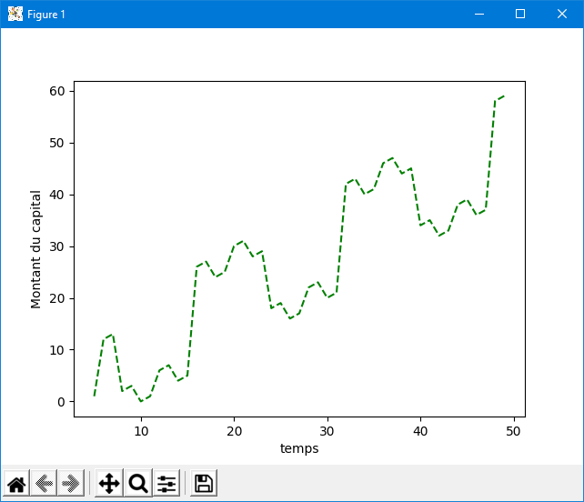
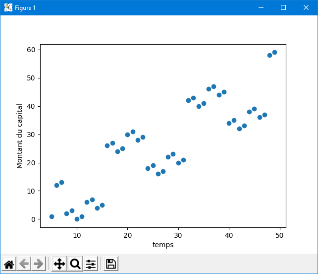
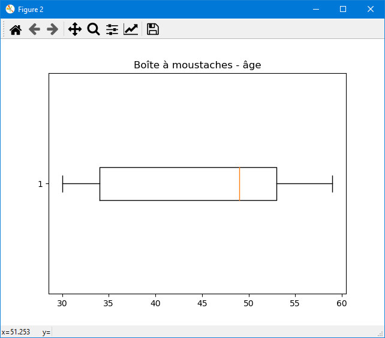
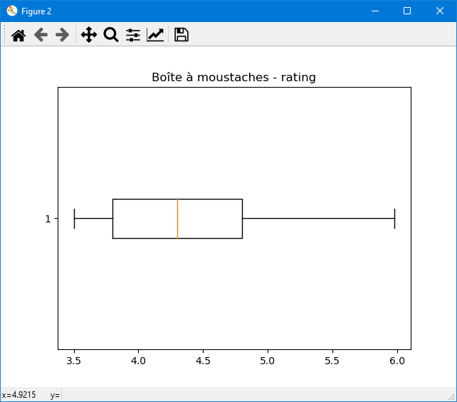
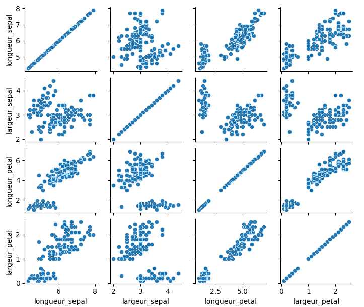
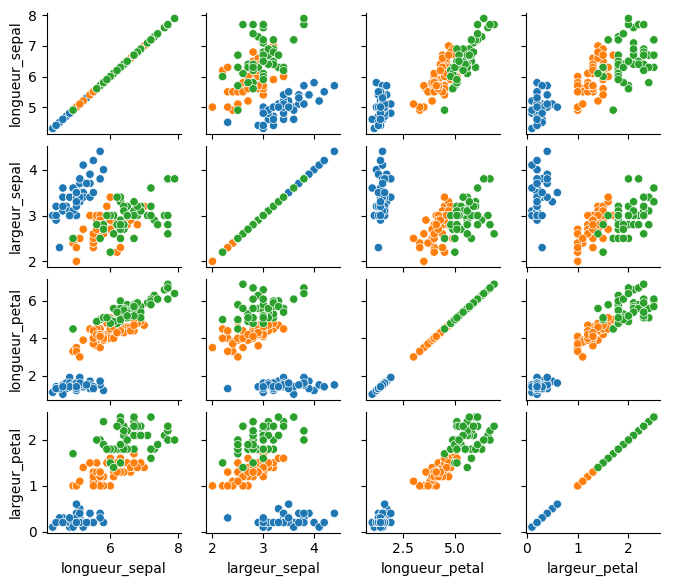
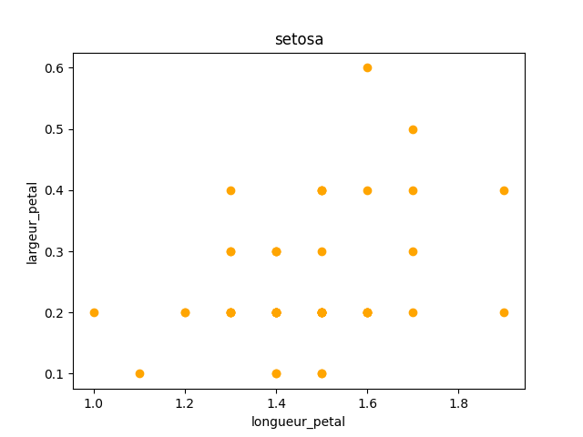
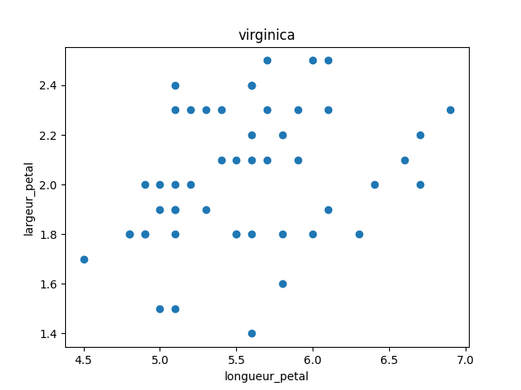
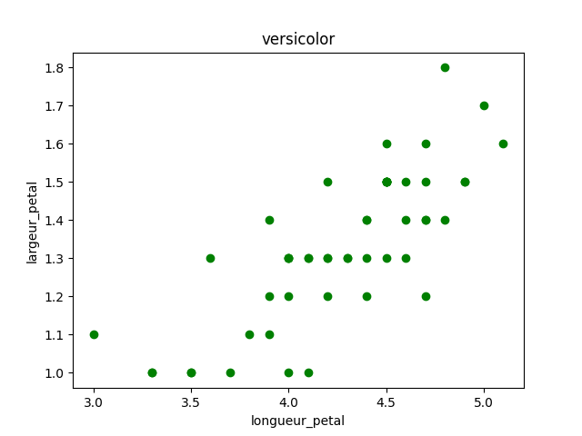
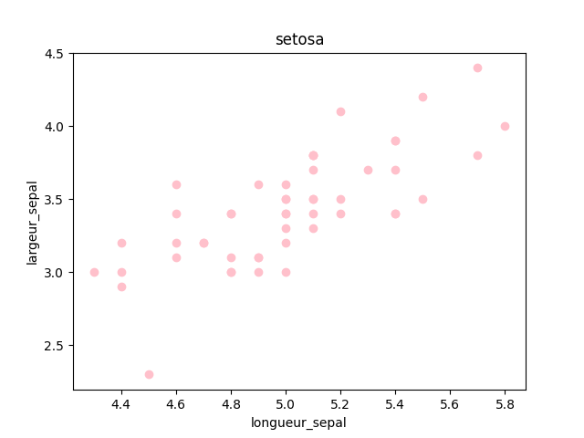

# P08_analyse2
Déploiement de l’environnement, Manipulation, Traitement des données, Visualisation de données et Analyse de données.
Ludivine M.

## Le code

Le code python executable figure dans le fichier analyse2.py
Les méthodes d'analyse appliquées et les résultats y figurent sous forme de commentaires.

## Illustrations du code

### Partie 4 : Montant du capital en fonction du temps

### Partie 5 : Analyse de la variance

Boîtes à moustache âge / classement (rating)

### Partie 5 : Analyse de correlation - recherche de liaisons

Recherche de correlation entre les variables quantitatives (dimensions pétale / sépale) sans tri préalable :

Avec prise en compte des différentes espèces d'Iris :

### Partie 5 : Analyse de correlation - analyse des liaisons

Illustration de l'analyse des relations entre les différentes dimensions lorsque l'on prend en comptel'espèce, à mettre en relation avec les coefficients de corrélation de Pearson trouvés dans la dernière partie du code.

___

